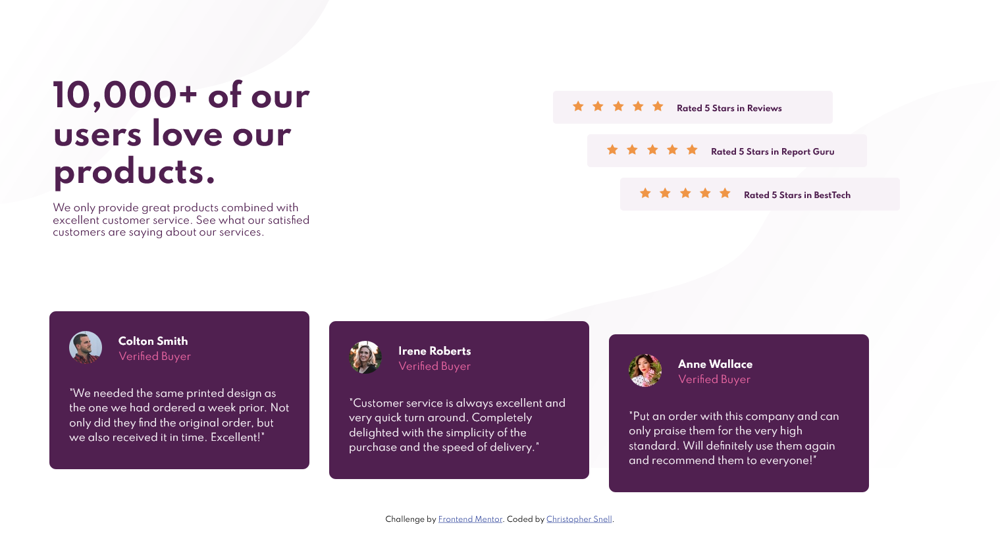

# Frontend Mentor - Social proof section solution

This is a solution to the [Social proof section challenge on Frontend Mentor](https://www.frontendmentor.io/challenges/social-proof-section-6e0qTv_bA). Frontend Mentor challenges help you improve your coding skills by building realistic projects. 

## Table of contents

- [Overview](#overview)
  - [The challenge](#the-challenge)
  - [Screenshot](#screenshot)
  - [Links](#links)
- [My process](#my-process)
  - [Built with](#built-with)
  - [What I learned](#what-i-learned)
  - [Continued development](#continued-development)
- [Author](#author)

## Overview

### The challenge

Users should be able to:

- View the optimal layout for the section depending on their device's screen size

### Screenshot

### Links

- Solution URL: [https://github.com/snellc1/Social-Proof](https://github.com/snellc1/Social-Proof)
- Live Site URL: [https://snellc1.github.io/Social-Proof/](https://snellc1.github.io/Social-Proof/)

## My process

### Built with

- Semantic HTML5 markup
- CSS custom properties
- Flexbox
- Mobile-first workflow

### Continued development

- Working with flexbox and eventually to work more with grids. 

- Work more with background images and make responsive with size. 

- Flexbox responsive as well. 

## Author

- Website - [Christopher Snell](https://snellc1.github.io/chrissnell/)
- Frontend Mentor - [@snellc1](https://www.frontendmentor.io/profile/snellc1)

